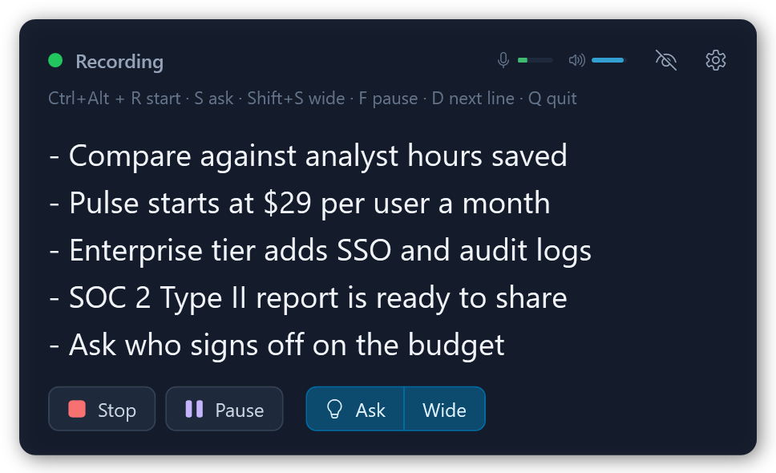
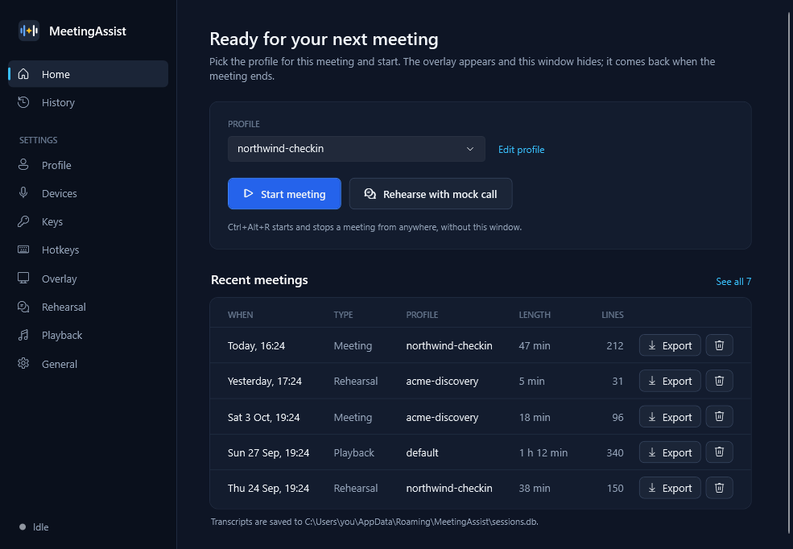
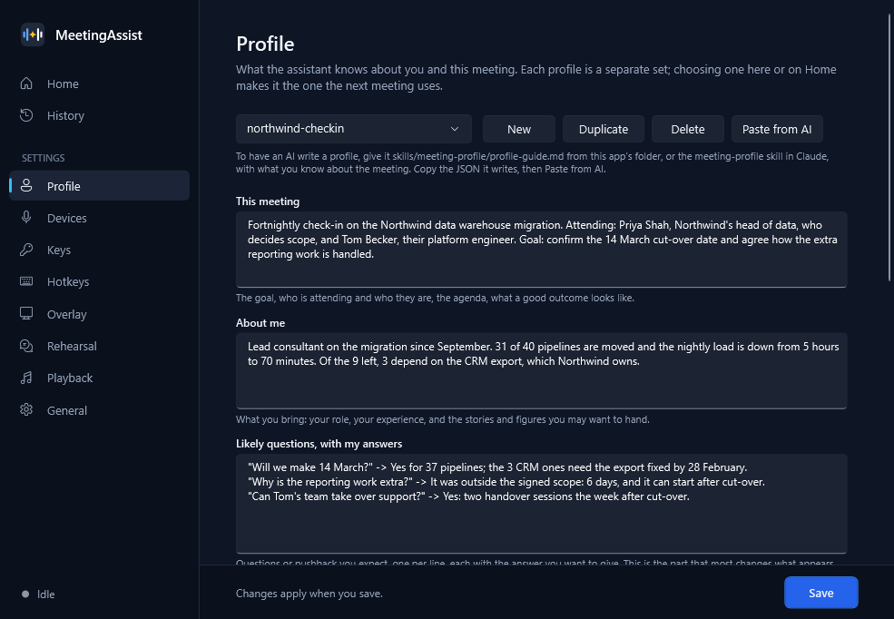

<p align="center"></p>

<h1 align="center">MeetingAssist</h1>

<p align="center">A meeting assistant for Windows. It transcribes both sides of an online call and,<br>
when you press a hotkey, shows short notes on what was just said and what you prepared.</p>

<p align="center"></p>

## What it does

- **Cue notes on demand.** Press Ask and get up to five short bullets: the figure, the name
  or the answer you prepared, at the moment the conversation needs it.
- **Prepared context.** Each meeting gets a profile: what it is about, what you bring, the
  questions you expect. Any AI chat can write one for you with the
  [included guide](skills/meeting-profile/profile-guide.md).
- **Rehearsals.** An AI plays the other side by voice, so you can practise the call first.
- **Transcripts.** Every meeting is saved on your computer and can be exported to a text file.
- **Your notes stay yours.** The overlay and the app's windows are excluded from screen
  capture, so sharing your screen shows your slides and not your notes.

| | |
|---|---|
|  |  |

## Getting started

You need Windows 10 (version 2004) or Windows 11.

Download **AIMeetingAssist-win-Setup.exe** from the
[latest release](https://github.com/danarde/AIMeetingAssist/releases/latest) and run it. It
installs for your user only, with no admin rights, and updates itself: a new version downloads
in the background and installs when you quit the app. The installer is not code-signed, so
Windows may say it "protected your PC": choose **More info → Run anyway**.

To build from source instead, install the [.NET 10 SDK](https://dotnet.microsoft.com/download):

```powershell
git clone https://github.com/danarde/AIMeetingAssist.git
cd AIMeetingAssist
dotnet build MeetingAssist.slnx
.\app.cmd
```

Then, in the app:

1. **Keys.** Paste two API keys and press **Test** on each:
   - [Groq](https://console.groq.com/keys) transcribes the audio.
   - [Google Gemini](https://aistudio.google.com/apikey) writes the notes and plays the other
     side in rehearsals.

   Both have free tiers ([Groq limits](https://console.groq.com/docs/rate-limits),
   [Gemini pricing](https://ai.google.dev/gemini-api/docs/pricing)). In a busy hour-long
   meeting Groq's free plan can fall behind; its paid Developer plan keeps up.
2. **Profile.** Describe the meeting, or press **Paste from AI** with a profile an AI wrote.
3. **Start meeting.** The overlay appears in a corner of the screen; the main window comes
   back when the meeting ends.

### Hotkeys

| Key | Action |
|---|---|
| `Ctrl+Alt+R` | Start or stop |
| `Ctrl+Alt+S` | Ask about the last minute |
| `Ctrl+Alt+Shift+S` | Ask about the last three minutes |
| `Ctrl+Alt+W` | Show or hide the overlay |
| `Ctrl+Alt+F` | Pause or resume |
| `Ctrl+Alt+X` | Hide everything at once |
| `Ctrl+Alt+Q` | Quit |

All of them can be changed on the Hotkeys page.

## Privacy

- Audio from your microphone and from the call goes to Groq to be transcribed. When you press
  Ask, the recent transcript and your profile go to Gemini. Nothing else leaves your computer.
- Keys are encrypted with your Windows account. Transcripts, profiles and settings stay in
  `%APPDATA%\MeetingAssist`.
- Two things cannot be hidden from a screen share: the small tray icon and the mouse cursor.

## Using it responsibly

Transcribing a conversation can require the consent of everyone in it, depending on where you
and they are, and some organisations and meetings have their own rules about tools like this.
How and where you use MeetingAssist is your decision and your responsibility.

## More

- [Development](docs/development.md): building, tests, the console harness, recording test audio.
- [Design notes](docs/spec-v1.md) and the [backlog](docs/backlog.md).

## License

[MIT](LICENSE)
